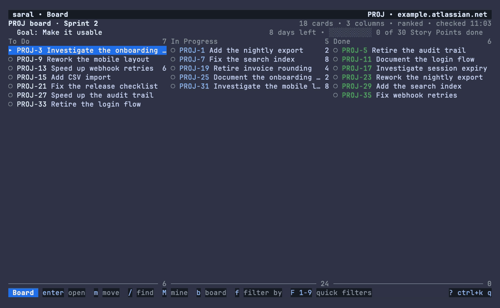
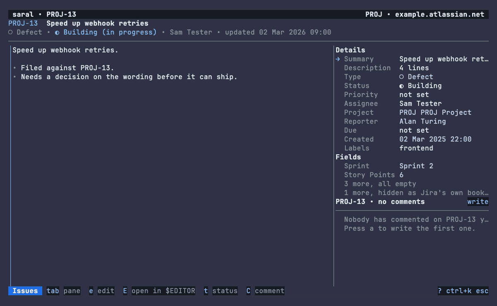
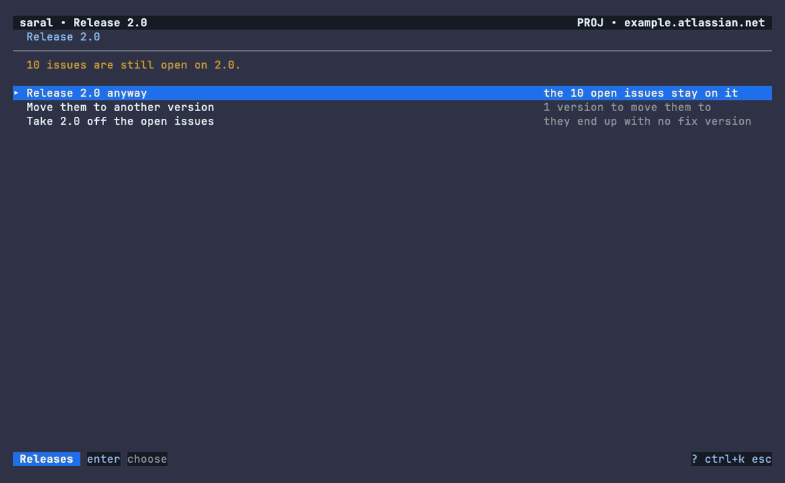
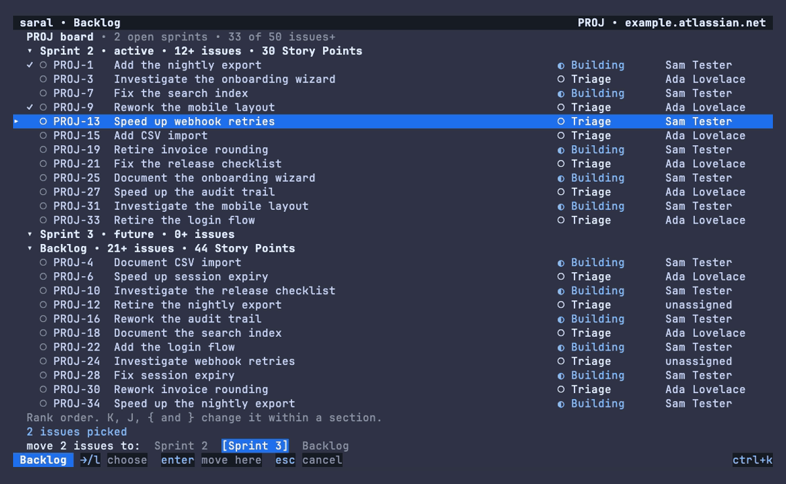

# Saral

**Jira in your terminal, made simple.**

*Saral* (सरल) is Hindi for simple, straightforward, plain. Saral gives you Jira's data without
Jira's web app: your issues, boards, sprints and releases, driven from the keyboard or the mouse, fast
enough that you stop reaching for the browser.


Everything in the recording is invented: it runs against Saral's built-in demo site, with no Jira
account and no network. [`docs/DEMO.md`](docs/DEMO.md) is how to re-record it.

| | |
|---|---|
|  |  |
| **The board**, showing the running sprint, its goal, the days left and the progress bar. | **An issue**, with the description, the fields and the comments on one screen. |
|  |  |
| **Releasing a version** that still has open issues: release anyway, move them, or take the version off them. | **Moving several issues** from the backlog to a sprint in one go. |

## Install

```sh
brew install varijkapil13/tap/saral                                                    # macOS
curl -fsSL https://raw.githubusercontent.com/varijkapil13/saral/main/scripts/install.sh | sh    # macOS, Linux
go install github.com/varijkapil13/saral/cmd/saral@latest                               # anywhere Go runs
```

The install script checks the download against the release's checksums before it installs anything,
and verifies the release's signature if `cosign` or `gh` is on your machine.

Every [release](https://github.com/varijkapil13/saral/releases) also has:

- **Linux packages**: `.deb`, `.rpm` and `.apk` for amd64 and arm64. Install one with your package
  manager, for example `sudo dpkg -i saral_<version>_amd64.deb` or `sudo rpm -i saral-<version>-1.x86_64.rpm`.
- **Windows**: `saral_<version>_windows_amd64.zip` (and `arm64`). Unzip it and put `saral.exe` on
  your `PATH`.
- **Plain archives** for macOS and Linux, with a `checksums.txt` beside them.

[`docs/INSTALL.md`](docs/INSTALL.md) covers every route, how verification works, and where the files
go. To upgrade, use `brew upgrade saral`, run the script again, or run `go install` again.

## Get started

1. [Create an API token](https://id.atlassian.com/manage-profile/security/api-tokens) for your
   Atlassian account.
2. Run `saral`. The first time, it opens setup and asks for four things: your site
   (`yourcompany.atlassian.net`), the email the token belongs to, where the token is kept, and a
   project to start in. It checks them against the site before it saves anything.
3. You land on your open issues. Press `?` to see the keys that work on the current screen, or
   `ctrl+k` for the command palette, which lists every command and the issues already on disk.

The seven main views are always one keystroke away: `g1` issues, `g2` board, `g3` backlog,
`g4` sprints, `g5` releases, `g6` timeline, `g7` plans.

```sh
saral                     # the active profile
saral ENG-142             # open an issue, by key or by its Jira link
saral board               # open a view by name
saral --project OPS       # work in another project for this run
saral --profile personal  # use another profile
saral doctor              # check your setup; the report is safe to paste into an issue
saral --help              # views, commands, environment variables and exit codes
```

## Why Saral

[jira-cli](https://github.com/ankitpokhrel/jira-cli) and jiratui are both good
tools, and if one of them already fits how you work, keep it. Saral is aimed at the parts of Jira
that people usually go back to the browser for:

- **Release management.** Create, edit, archive and release versions. When a version still has open
  issues, Saral asks what to do with them: release anyway, move them to another version, or take
  the version off them. You can also put a version on, or take it off, every issue a JQL query
  matches.
- **Sprints and boards.** The board shows the running sprint with its goal, days left and a progress
  bar. You can rank cards, move them between columns with one key, and complete a sprint with a
  choice of where its open issues go.
- **Bulk moves.** Move a set of issues between sprints and the backlog, or between projects with
  the cross-project move wizard, which maps statuses and fields and tells you which fields the
  move would drop.
- **Timeline.** Bars built from real start and end dates, with sprint and version markers, and a
  note on where each bar's dates came from.
- **Forms that match your site.** The create form and the editable fields are built from your
  site's own create and edit screens, custom fields included. Saral has no field IDs, statuses or
  project keys built in.
- **Fast first paint.** Views draw from a local cache straight away and then check the site in the
  background, so a refresh never moves your cursor or your scroll position.
- **The mouse works too.** Click a row, a status or a column, drag a card or a divider, or
  right-click for the actions that apply. `--mouse=false` turns it off for text selection.
- **Missing permissions are explained.** If your token cannot do something, the feature is hidden or
  disabled, and Saral shows the site's own reason. It does not crash, and it does not show an empty
  list without saying why.
- **No telemetry.** The only network traffic is to your Jira site.

## What your token needs

Saral uses your own account's permissions, so it can do what you can do in the browser. Everything
is optional except browsing the project; a missing permission switches off only the features that
need it, and Saral says so.

| To | Jira permission | Without it |
|---|---|---|
| See issues, boards, sprints and versions | **Browse Projects** on the project | nothing in that project is readable |
| Create, edit, transition, assign and comment | **Create Issues**, **Edit Issues**, **Transition Issues**, **Assign Issues**, **Add Comments** | the write is refused, with the site's reason on the status line |
| Pick people, assign by name, @mention | **Browse users and groups** (global) | people pickers offer only you; mention search says why it is off |
| Attach files | **Create Attachments**, and attachments switched on for the site | the attachment view says attachments are off |
| Create, start and complete sprints | **Manage Sprints** | the sprint actions are refused |
| Create, edit and release versions | **Administer Projects** on the project | the release actions are refused |
| Move issues between projects | **Bulk Change** (global), **Move Issues** in the source project, **Create Issues** in the target | the move wizard is disabled, with the missing permission named |
| Log work, and see or change watchers | **Work On Issues**; **View Voters and Watchers**, **Manage Watchers** | those sheets say what the token cannot see |
| Real plans | **Administer Jira**, on a Jira Premium site | Saral shows local plans built from your project and saved queries |

## Accounts and sites Saral supports

Saral works with **Jira Cloud** using an **API token and the account's email address**. The token is
never written to the config file: you tell Saral where to find it, in the system keychain, in an
environment variable, or from a command such as a password manager.

**Not supported yet:** scoped API tokens, OAuth 2.0, and single sign-on accounts whose organisation
blocks API tokens (Saral says so when a site refuses the token for that reason). **Jira Data Center
and Server are not supported**; setup detects them and stops.

## Privacy: what Saral keeps on your machine

Saral sends requests only to your Jira site. It keeps these files locally:

| What | Where (macOS and Linux) | What is in it |
|---|---|---|
| `config.toml` | `~/.config/saral/` | your profiles, where each token is kept (never the token), saved queries, theme |
| `drafts/` | `~/.config/saral/drafts/` | text you have not sent yet: unsaved issue edits, comments and create forms |
| `cache.db` | `~/.cache/saral/` | issues, searches, boards, backlogs, sprint and version lists, and what your token is allowed to do, per profile |
| `ui.toml` | `~/.cache/saral/` | split widths, sort orders, the view each profile last opened and the filters it kept |
| `palette/` | `~/.cache/saral/palette/` | which commands and projects you use most, to rank the palette |

The cache is bounded: at most 5,000 issues per profile, and entries not updated for 30 days are
dropped. A profile you remove from `config.toml` has its cache dropped the next time Saral starts.

To wipe it:

- **Clear the cache** in settings (`g s`) empties the active profile's cache.
- Quit Saral and delete `~/.cache/saral` to remove every cached file, or `~/.config/saral` to
  remove your profiles and drafts as well.
- `brew uninstall --zap saral` removes the app and both directories.

`SARAL_CONFIG_DIR` and `SARAL_CACHE_DIR` move the two directories, and `XDG_CONFIG_HOME` and
`XDG_CACHE_HOME` are honoured. A build from a source checkout uses `saral-dev` in place of `saral`,
so it never shares files with an installed copy. [`docs/SETTINGS.md`](docs/SETTINGS.md) has the full
list.

`saral --log FILE` writes one line per request (method, path, status, time) for debugging. Tokens,
emails, cookies and query strings are left out.

## Scripting

Saral also has commands that run without the terminal UI, for scripts and CI jobs:

```sh
saral search 'assignee = currentUser() AND resolution = EMPTY' --json
saral issue view ENG-142 --json
saral issue create --project ENG --type Task --summary 'Rotate the keys'
saral transition ENG-142 'In Review'
saral comment add ENG-142 -m 'Deployed to staging'
saral assign ENG-142 me
saral completion zsh
```

Plain output is tab-separated; `--json` output has a documented, stable schema. With no config
file, `SARAL_SITE`, `SARAL_EMAIL` and `SARAL_TOKEN` form a profile of their own, which is how a CI job
runs them. [`docs/CLI.md`](docs/CLI.md) documents every command, the JSON schema and the exit codes.

## Configuration

Setup writes `~/.config/saral/config.toml`. You can edit it by hand, or change most of it from the
settings screen (`g s`):

```toml
version = 1
active  = "work"

[profiles.work]
site    = "example.atlassian.net"
email   = "you@example.com"
project = "ENG"
theme   = "dark"                         # or light, no-color; omit to follow the terminal
glyphs  = "unicode"                      # "nerd" for Nerd Font icons, "ascii" for plain text
token   = { keychain = "saral:work" }    # or { env = "JIRA_TOKEN" } / { command = ["pass", "jira"] }

[profiles.work.timeline]
start = ["Target start", "Start date"]   # field names, looked up on your site
end   = ["Target end", "Due date"]

[[profiles.work.queries]]
name = "Blockers"
jql  = "priority = Highest AND resolution = EMPTY ORDER BY updated DESC"
key  = 2                                 # press 2 to run it
```

Icons default to plain unicode symbols, because no terminal can report whether a Nerd Font is
installed. If you have one, set `glyphs = "nerd"` or pick it in settings.

Precedence is flags, then environment variables, then the file. `SARAL_PROFILE` picks a profile, and
`SARAL_SITE`, `SARAL_EMAIL` and `SARAL_TOKEN` override its fields for one run. Exit codes are `0`
success, `1` any other failure, `2` a flag or argument was not understood, `3` the config or profile
is unusable, and `4` the token was not found or the site refused it.

## Reporting a bug

Run `saral doctor` and paste its output into a
[new issue](https://github.com/varijkapil13/saral/issues/new/choose). It checks your config, token,
site, cache and proxy, and it never prints the token and shortens your email. Please also say which
terminal you use. Never paste a token, and leave out anything from your site you would not want
public.

Report a security problem privately, as [`SECURITY.md`](SECURITY.md) describes, not in a public issue.

## Use as a library

The Jira client is a standalone package with a semver promise, useful even without the TUI:

```go
import "github.com/varijkapil13/saral/pkg/jira"
```

`pkg/jira` is the port (56 methods in domain terms, none of them shaped like the REST call
underneath) plus a Cloud adapter and an in-memory fake, `pkg/jira/jiratest`. `pkg/adf` converts
Atlassian Document Format to and from markdown without losing nodes it does not understand.
Everything under `internal/` is the application and carries no compatibility promise.

## Contributing

Read [`CONTRIBUTING.md`](CONTRIBUTING.md). **You do not need a Jira account to build or test.** The
whole suite runs against the in-memory fake and recorded fixtures, with no network, and
`go run -tags demo ./cmd/saral -fake` opens the app on the same invented site the demo uses.

| Document | What's in it |
|---|---|
| [`CHANGELOG.md`](CHANGELOG.md) | What changed in each release, and what is not released yet |
| [`docs/UX.md`](docs/UX.md) | Navigation, every key, the mouse, terminal rendering rules |
| [`docs/CLI.md`](docs/CLI.md) | The scriptable commands and their JSON |
| [`docs/SETTINGS.md`](docs/SETTINGS.md) | Settings, and every file Saral keeps |
| [`docs/FIELDS.md`](docs/FIELDS.md), [`docs/FILTERS.md`](docs/FILTERS.md) | Fields on an issue; filtering, sorting and icons |
| [`docs/INSTALL.md`](docs/INSTALL.md) | Every install route, and verification |
| [`docs/ARCHITECTURE.md`](docs/ARCHITECTURE.md) | Layers, the port, caching, rendering, errors |
| [`docs/API-NOTES.md`](docs/API-NOTES.md) | Every Jira API trap found so far, and how each is known |
| [`docs/TESTING.md`](docs/TESTING.md) | The fake, fixtures, golden files, conformance |
| [`docs/PERFORMANCE.md`](docs/PERFORMANCE.md) | Budgets, and which of them a build fails on |
| [`docs/SCOPE.md`](docs/SCOPE.md) | What is in, what is out |
| [`docs/ROADMAP.md`](docs/ROADMAP.md) | Batches and packets |

## Built with

[Bubble Tea v2](https://github.com/charmbracelet/bubbletea) ·
[Lip Gloss v2](https://github.com/charmbracelet/lipgloss) ·
[Bubbles v2](https://github.com/charmbracelet/bubbles) ·
[bubblezone v2](https://github.com/lrstanley/bubblezone) · [bbolt](https://github.com/etcd-io/bbolt)

## License

MIT
